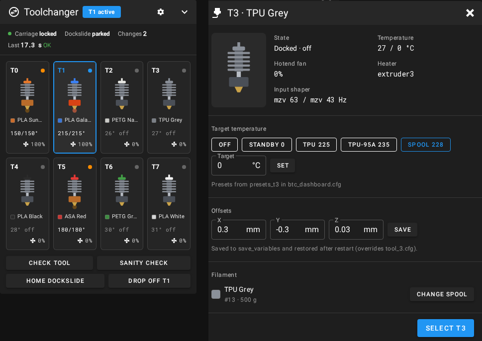

# Toolchanger Dashboard for BTC (Bikin Toolchanger)

A dashboard panel for Klipper printers that swap hotends with the **BTC (Bikin Toolchanger)** macros, such as [Lineux Hotswap](https://github.com/3dfiyMyLife/Lineux-Hotswap). It shows a picture of each hotend with its filament colour, temperature and fan speed. Click a hotend to select it, set its temperature, change its spool or edit its offsets.

> **Status:** tested against a simulated 8-tool printer, not yet on real hardware. The installer edits `printer.cfg` and `moonraker.conf`, can replace your Mainsail or Fluidd, and can patch one line of BTC. It keeps a backup of everything it changes, but read [what it does](#what-the-installer-does) first.



I built this for my Voron 2.4 350, which swaps hotends with the BTC macros and probes with a Voron Tap, so a hotend has to be on the carriage before every probe. I wanted the at-a-glance view Happy Hare gives MMU users: which hotend is on the carriage, which ones are heating, and one click to change tools.

You can see it in three places, and all three read the same Klipper add-on:

- **Inside Mainsail.** A *Toolchanger* panel on the dashboard. See [`mainsail/README.md`](mainsail/README.md).
- **Inside Fluidd.** A *Toolchanger* card on the dashboard. See [`fluidd/README.md`](fluidd/README.md).
- **Standalone page.** Its own page on port 8137, handy for another browser or a spare screen.

It doesn't change how BTC works. BTC still does every move, check and toolchange. The dashboard only reads BTC's state and runs BTC's own commands.

```
ToolChangerDashboard/
├── klippy/btc_dashboard.py      Klipper add-on: publishes printer.btc_dashboard
├── mainsail/                    Mainsail panel: patch, install script, screenshots
├── fluidd/                      Fluidd card: patch, install script, screenshots
├── scripts/install_ui_build.sh  Downloads and swaps the Mainsail/Fluidd builds in and out
├── ui-builds.conf               Which release the builds come from (+ checksums)
├── www/                         Standalone page (plain HTML/CSS/JS, no build step)
├── config/btc_dashboard.cfg.example
├── nginx/btc-dashboard.conf     Serves the standalone page + proxies Moonraker
├── install.sh / uninstall.sh
└── tests/                       Offline tests (fake Klipper + mock Moonraker)
```

## Requirements

- **Klipper or Kalico**, with **Moonraker**, installed the usual way (KIAUH or similar), so `~/klipper` and `~/printer_data` exist. The add-on uses the Python 3 that Klipper already runs on.
- **The BTC macros** (`btc.cfg`, `btc_variables.cfg` and a `tool_N.cfg` per hotend) from [Lineux Hotswap](https://github.com/3dfiyMyLife/Lineux-Hotswap/tree/main/Klipper), already working.
- **Mainsail or Fluidd** in `~/mainsail` or `~/fluidd`. The panel comes as a complete build of **Mainsail 2.19.0** or **Fluidd 1.37.6**. Installing it switches you to that version, whatever you're on now.
- `git`, `curl` and `unzip` (`sudo apt install git curl unzip`).
- Optional: **Spoolman**, connected to Moonraker. Optional: **nginx**, only needed for the standalone page.

## Install

On the printer's Pi, as your normal user:

```bash
git clone https://github.com/JeandreCoetzer/ToolChangerDashboard.git ~/btc-dashboard
cd ~/btc-dashboard
./install.sh
```

The installer finds your tools and asks a few questions. Each one has a sensible default:

| Question | Options | Default |
|---|---|---|
| How many tools | `auto` or a number | `auto`, meaning every `_VARIABLES_Tn` macro it finds |
| Dock sense switches | `none` / `per_tool` | `none`, since Lineux only has the carriage switch |
| Carriage switch name | a gcode_button name | `carriage_sense` |
| Dockslide | `auto` / `yes` / `no` | `auto`, meaning on if `DOCKSLIDE_HOME` exists |
| Spoolman | `auto` / `yes` / `no` | `auto`, meaning on if Moonraker has `[spoolman]` |
| Keep edited offsets after restart | y / n | y (adds `[save_variables]` if you don't have one) |

`./install.sh -y` skips the questions and uses the defaults. `-k`, `-d`, `-p` and `-m` change the Klipper folder, printer_data folder, standalone page port and Moonraker port.

### What the installer does

1. Links `btc_dashboard.py` into `~/klipper/klippy/extras/`.
2. Writes `~/printer_data/config/btc_dashboard.cfg` and adds `[include btc_dashboard.cfg]` to the top of `printer.cfg`, keeping a backup of `printer.cfg`.
3. **Only if you have more than 6 tools:** offers to patch BTC itself. BTC's startup macro in `btc.cfg` only registers T0–T5 (`for tools in range(6)`). The installer changes that one line to `range(16)` and keeps a backup next to the file (`btc.cfg.btcdash-<date>.bak`). Updating or re-copying BTC's files puts `range(6)` back, so run `./install.sh` again afterwards.
4. Adds `[update_manager btc_dashboard]` to `moonraker.conf` (with a backup), so updates show up in Mainsail's and Fluidd's update screens.
5. For each of `~/mainsail` and `~/fluidd` that exists, offers to install the build with the Toolchanger panel. It downloads the zip from this repo's [GitHub release](https://github.com/JeandreCoetzer/ToolChangerDashboard/releases) and checks its checksum. It then copies the official build to `~/mainsail.official-backup` (or `~/fluidd.official-backup`) and keeps your `config.json`. Updating Mainsail or Fluidd from the Update Manager puts the official build back; run `./install.sh` or the build script again after that.
6. Optionally installs an nginx site on port **8137** for the standalone page.
7. Restarts Klipper.

Then open Mainsail or Fluidd. In Mainsail, move the panel under **Settings → Dashboard**; in Fluidd, use the dashboard's layout mode. Run `BTC_DASHBOARD_STATUS` in the console to see what the add-on found.

### Without nginx

Serve `www/` any way you like and point it at Moonraker with a query string, for example `http://host:8000/?moonraker=192.168.1.50:7125`. Moonraker must allow that origin in `cors_domains`.

## Where the data comes from

| Panel shows | Klipper source |
|---|---|
| Active tool | `gcode_macro _BTC_VARIABLES.tool_current_asperbtc` |
| Offsets, input shaper, pressure advance | `gcode_macro _VARIABLES_Tn` |
| Temperature and target | `extruder`, `extruder1`, … (taken from each `Tn` macro's `ACTIVATE_EXTRUDER`) |
| Hotend fan | the `heater_fan` whose `heater:` is that extruder |
| Spool | `gcode_macro Tn.spool_id`, with details from Spoolman through Moonraker |
| Carriage | `gcode_button carriage_sense` |
| Dock sensors | `gcode_button dock_sense_t{n}` (only when `dock_sense: per_tool`) |
| Dockslide | `gcode_macro _DOCKSLIDE_VARIABLES.dockslide_status`, endstop buttons |
| Temperature presets | `btc_dashboard.cfg` or the tool's own file (see below) |
| Toolchange log and times | recorded by the add-on (see below) |

**Toolchange timing.** The add-on wraps `TOOL_PICKUP` and `TOOL_DROPOFF`. The originals still run unchanged. The wrapper notes the start and end, then checks the result:

- **Pickup:** the tool must be registered on the carriage afterwards.
- **Dropoff:** `last_dropoff_successful` must be set and the carriage must be empty afterwards.

Durations use Klipper's motion clock, so they include the move time and any reheat wait.

**Offsets.** "Save" in the popup runs `BTC_DASHBOARD_SET_OFFSET TOOL=n X= Y= Z=`. That updates `_VARIABLES_Tn` straight away, and applies the new offset if that tool is on the carriage and no print is running. With `save_offsets` on, the values also go into `[save_variables]` and come back after a restart. They **override** the numbers in `tool_n.cfg`, and the console says so at startup. To go back to the cfg values, run `BTC_DASHBOARD_CLEAR_SAVED_OFFSETS` and restart.

**Filament without Spoolman.** With `spoolman: no`, the popup lets you set a material and colour for each tool instead.

## Temperature presets (per tool)

Each tool's popup shows preset buttons from the Klipper config. Edit `btc_dashboard.cfg`:

```ini
[btc_dashboard]
presets: Standby:150, PLA:215, PETG:240        # every tool without its own list
presets_t2: Standby:160, PETG:240, ASA:255     # T2 only
presets_t3: Standby:0, TPU:225                 # T3 only
```

You can also put a list in the tool's own file, where it takes priority over both of the above:

```ini
[gcode_macro _VARIABLES_T3]
variable_temp_presets: "Standby:0, TPU:225"
```

Restart Klipper after a change. `BTC_DASHBOARD_STATUS` lists each tool's presets and where they came from, and the popup shows the source too, so you know which line to edit.

If a preset is badly written, or hotter than that heater's `max_temp`, it is left out and a warning appears on the panel. When the tool has a Spoolman spool, an extra **Spool** button uses the filament's print temperature from Spoolman.

## Commands

| Command | What it does |
|---|---|
| `BTC_DASHBOARD_STATUS` | Lists the tools found, how each was mapped and its presets, plus any warnings |
| `BTC_DASHBOARD_SET_OFFSET TOOL=1 X=-0.12 Y=0.35 Z=0.04 [SAVE=0]` | Sets a tool's offsets (`SAVE=0` = until restart only) |
| `BTC_DASHBOARD_CLEAR_SAVED_OFFSETS` | Forgets the saved offsets |
| `BTC_DASHBOARD_RESET_STATS` | Clears the counters and the log |

The panel itself runs BTC's own commands: `Tn`, `TOOL_DROPOFF`, `CHECK_CARRIAGE`, `SANITY_CHECK_TOOLS`, `DOCKSLIDE_HOME` and `SET_HEATER_TEMPERATURE`. Tool changes, offset edits and the action buttons are locked while printing. Temperatures can still be set during a print.

## Panel settings

The gear icon on the panel opens its display settings: tiles per row, and whether to show the status line, the action buttons (Mainsail and Fluidd) and the toolchange log. The standalone page can also ask before each tool change. Mainsail and Fluidd save these with the rest of their settings in Moonraker, and the standalone page saves them in Moonraker's database (namespace `btc_dashboard`), so every browser sees the same layout for that printer. Temperature presets are not set here; they come from the Klipper config (see above).

## Config reference

See [`config/btc_dashboard.cfg.example`](config/btc_dashboard.cfg.example). If your heaters or fans don't follow BTC's naming, set `extruder_names` and `hotend_fan_names` (comma-separated, in tool order).

## Testing without a printer

```bash
python3 tests/test_klippy.py                    # add-on against a fake Klipper
pip install websockets playwright
playwright install chromium                     # browser for the UI check
TOOLS=8 python3 tests/mock_moonraker.py &       # fake Moonraker on :7125
(cd www && python3 -m http.server 8137 &)
python3 tests/ui_check.py /tmp                  # screenshots of the standalone page
```

`tests/mock_moonraker_mainsail.py` is a fuller fake Moonraker that a real Mainsail or Fluidd build can connect to.

## Uninstall

```bash
cd ~/btc-dashboard
./uninstall.sh
```

This removes the add-on link, the include line, the update manager entry and the nginx site. If you installed the Mainsail or Fluidd build, it also puts the official one back from `~/mainsail.official-backup` / `~/fluidd.official-backup`. It renames `btc_dashboard.cfg` instead of deleting it and keeps backups of every file it edits. A BTC patch (step 3 above) is left in place, because it only matters with more than 6 tools; restore `btc.cfg` from its `.bak` file if you want it back.

To put just the official Mainsail or Fluidd back and keep the rest:

```bash
./mainsail/install_mainsail_build.sh --restore
./fluidd/install_fluidd_build.sh --restore
```

## Limitations

- The Mainsail panel and Fluidd card come as modified builds until each project accepts them. Updating Mainsail or Fluidd from the Update Manager replaces the modified build with the official one. The `mainsail/` and `fluidd/` READMEs explain how to keep your own copy that updates normally.
- BTC still has to track which tool is on the carriage. The carriage switch can tell that a tool is there, but not which one.

## Contributing and licence

Bug reports and pull requests are welcome; see [CONTRIBUTING.md](CONTRIBUTING.md), which also covers rebuilding the Mainsail and Fluidd builds and the plan to get the panel into the official projects.

Licensed under the [GNU GPL v3](LICENSE), the same licence as Klipper, Mainsail and Fluidd.
